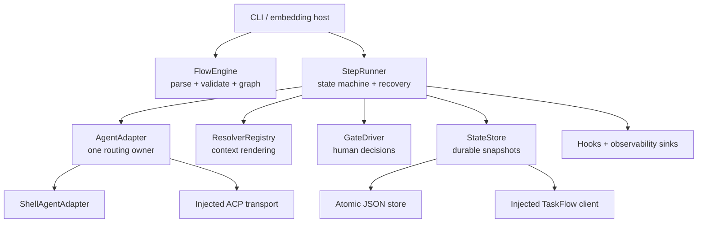

# Architecture

AgentLane separates flow semantics from execution transports and host integrations. The standalone
CLI composes the same core contracts that an embedding runtime can replace.

## Ownership boundaries

`FlowEngine` owns syntax, semantic validation, dependency analysis, and stable layer ordering. It
does not execute agents or persist state.

`StepRunner` owns the runtime state machine: layer scheduling, retry and timeout policy, prompt
resolution, gates, bounded jumps, failure cleanup, and recovery. It depends on narrow injected
interfaces rather than on CLI configuration.

`AgentAdapter` is the only agent-routing abstraction. The shell adapter maps agent IDs to direct
subprocess commands; an embedding host can instead inject one ACP transport. A second registry of
adapters would split routing ownership and is intentionally absent.

`StateStore` owns complete `FlowRun` snapshots. The standalone JSON store reloads under an
inter-process lock before every mutation, writes a temporary file, fsyncs it, and atomically
replaces the state file. Non-concurrent stores are serialized by the runner. `TaskFlowStateStore`
adapts an injected host client and rolls local state back if the remote save fails.

Resolvers are synchronous extension contracts dispatched through daemon threads with bounded
waits. A timed-out extension cannot block event-loop shutdown. Hooks and observability sinks are
isolated composites: their failures are logged and cannot silently convert successful workflow
work into a failed run.

## Runtime invariants

- A new run is created only after flow, resolver, and required-secret validation succeeds.
- The original YAML snapshot is persisted and is authoritative for resume.
- A step executes only after every dependency is completed or explicitly skipped.
- Steps in the same dependency layer run concurrently; layer order is stable relative to YAML.
- Every attempted step and gate increments a durable visit counter before work begins.
- Failed work never remains in `running`; fail-fast cancellation is awaited and persisted.
- Missing secrets are fatal. Missing environment or memory context is substituted with empty text
  and emitted as an observability event.
- Memory writes are best-effort and bounded; they never invalidate completed agent work.
- Gate decisions are immutable audit records. Jumps reset their target and all descendants.
- Retry/edit recovery preserves upstream results and resets downstream derived state.

## Failure model

Expected adapter failures become normalized `AgentResult` values and consume the configured retry
budget. Definition and resume misuse raise typed domain exceptions before unsafe execution. An
unexpected runner error marks the run failed, stores a diagnostic in `__flow_error`, emits an error
event, and is re-raised so an embedding host cannot mistake it for a normal agent failure.

The shell adapter terminates a timed-out process, waits briefly, and escalates to kill if needed. On
async task cancellation it performs the same cleanup before propagating cancellation.

## Persistence and compatibility

The JSON format is versioned at the file level and stores enum values and ISO-8601 timestamps.
Public compatibility modules (`agentlane.models`, `agentlane.state`, and similar) re-export canonical
objects from `agentlane.core`; canonical implementation ownership remains under `agentlane.core`.

This alpha keeps persistence intentionally simple: one JSON file rather than a hidden SQLite
dependency. Hosts needing different durability can provide a `StateStore` without changing flow
semantics.

## Host integration seams

OpenClaw-style integration is explicit dependency injection:

- `ACPAgentAdapter(transport)` accepts a host-owned callable and normalizes its response.
- `TaskFlowStateStore(client)` expects `load_all`, `save`, and `delete` methods.
- `FlowHook` supports lifecycle behavior; `ObservabilitySink` supports passive telemetry.

These are seams, not claims of a standalone ACP service or universal TaskFlow implementation.
