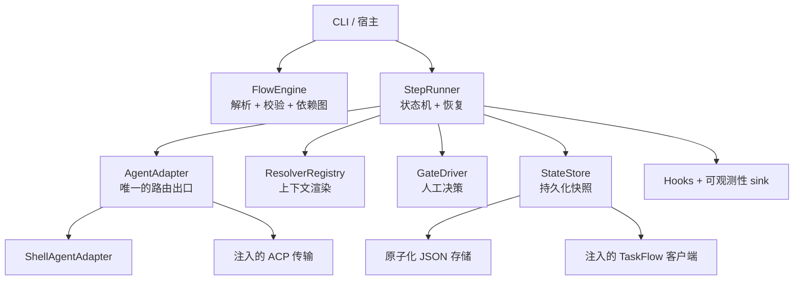

# 架构说明

AgentLane 把"流程语义"和"执行传输层 / 宿主集成"分开。独立的 CLI 组合的就是同一套核心契约——
这套契约也可以被嵌入式的运行时整体替换掉。

## 职责边界

`FlowEngine` 负责语法、语义校验、依赖分析、以及稳定的分层排序。它**不**执行 agent，也**不**持久化状态。

`StepRunner` 负责运行时的状态机：分层调度、重试与超时策略、prompt 解析、关卡、有界跳转、失败清理、
以及恢复。它依赖的是几个窄接口（注入进来），而不是直接依赖 CLI 配置。

`AgentAdapter` 是**唯一**的 agent 路由抽象。shell adapter 把 agent ID 映射成直接的子进程命令；
嵌入式宿主也可以注入一个 ACP 传输来替代。再搞第二个 adapter 注册表会把路由归属拆散，所以这里**故意
只有一套**。

`StateStore` 负责完整的 `FlowRun` 快照。独立的 JSON 存储在每次写入前都在进程间锁保护下重新加载，
写到临时文件、fsync、再原子替换状态文件。非并发安全的存储由 runner 串行化。`TaskFlowStateStore`
适配一个注入的宿主客户端，如果远端保存失败会把本地状态回滚。

Resolver 是同步的扩展契约，通过一个**有界的 daemon 线程池**派发，等待也是有界的。线程池限制了同时
能跑多少个扩展，所以一个 prompt 不会 spawn 出无限多的线程；超时的扩展不会卡住事件循环的关闭。这个
池是**可注入**的 `WorkerPool`：`StepRunner` 和 `ResolverRegistry` 接受一个池，没传就用进程级默认池——
这样宿主可以自己定大小或替换它，测试也能隔离它。Hooks 和可观测性 sink 是隔离的组合：它们的失败只会
被记录日志，**不会**把一次成功的工作流悄悄变成失败。

## 运行时不变量（invariant）

- 新建运行的前提是：流程、resolver、以及必需的 secret 都校验通过。
- 原始 YAML 快照会被持久化，并在 resume 时作为权威来源。
- 一个步骤只有在它的每个依赖都已完成或被显式跳过后才会执行。
- 同一依赖层里的步骤并发执行；层的顺序相对于 YAML 是稳定的。
- 每个被尝试的步骤和关卡，在开始干活前都会递增一个持久化的访问计数器。
- 失败的工作绝不会停留在 `running` 状态；fail-fast 的取消会被 await 完成并持久化。
- 缺失的 secret 是致命的。缺失的环境变量或 memory 上下文会被替换成空文本，并发出一个可观测事件。
- memory 写入是尽力而为且有界的；它们绝不会让已完成的 agent 工作失效。
- 关卡决策是不可变的审计记录。跳转（goto）会重置目标步骤及其所有下游。
- 重试 / 编辑的恢复会保留上游结果，并重置下游派生状态。

## 失败模型

预期的 adapter 失败会被归一化成 `AgentResult` 值，并消耗配置好的重试预算。流程定义和 resume 的误用
会在不安全执行**之前**抛出带类型的领域异常。一个意料之外的 runner 错误会把运行标记为失败、在
`__flow_error` 里存一条诊断、发出错误事件，然后**重新抛出**——这样嵌入式宿主不会把它误当成一次
普通的 agent 失败。

shell adapter 在进程超时时会终止它、短暂等待、必要时升级到 kill。在 async 任务被取消时，它也会先做
同样的清理再传播取消。

## 持久化与兼容性

JSON 格式在文件层面有版本号，存储的是枚举值和 ISO-8601 时间戳。公共兼容模块（`agentlane.models`、
`agentlane.state` 等）只是从 `agentlane.core` 重新导出规范对象；规范的实现归属始终在 `agentlane.core` 下。

这个 alpha 版本有意把持久化做得简单：一个 JSON 文件，而不是偷偷引入一个 SQLite 依赖。需要不同持久化
保证的宿主可以提供自己的 `StateStore`，而不用改流程语义。

## 宿主集成接缝

OpenClaw 式的集成是显式的依赖注入：

- `ACPAgentAdapter(transport)` 接受一个宿主拥有的 callable，并归一化它的响应。
- `TaskFlowStateStore(client)` 要求该客户端实现 `load_all`、`save`、`delete` 方法。
- `FlowHook` 支持生命周期行为；`ObservabilitySink` 支持被动遥测。

这些只是**接缝**，不是声称提供了一个独立的 ACP 服务或通用的 TaskFlow 实现。
